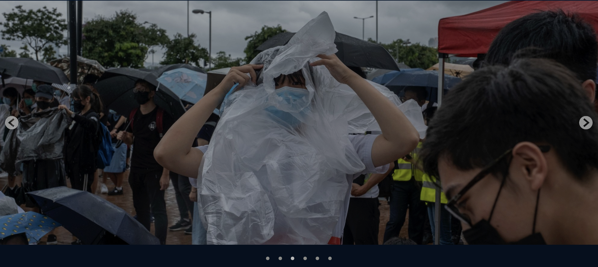

### Summary

---

Please make a carousel UI component which contains images by using assets provided in `/assets` folder.
The UI component should meet the requirements included in `spec` section.

### Spec

---

1. mockup

- There are 6 photos in this carousel
- Two arrow buttons on the left and right hand side respectively
- 6 bullets are placed under the image
  - Bullets have two state, default and active. For example, if the component is showing the first photo, the first bullet is in active state, and the rest stay in default state.
  - colors for bullets in different state
    - default: rgb(190, 192, 188)
    - active: white

Please note that we do not specify the detailed properties in the mockup above, for example, padding, margin...etc.
You can make the call on those detailed properties.

2. features

- When one of the arrow buttons is clicked:
  - Photo changes with sliding animation, please check the [reference](https://www.twreporter.org/photography).
  - The active bullet also changes corresponds to photo changes

Please note that infinite carousel is not included in requirement.
